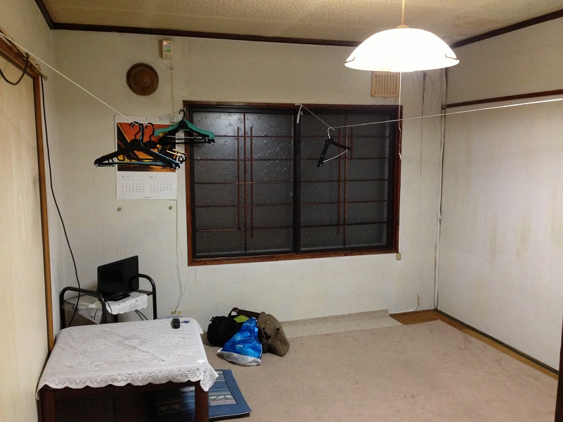

## はじめに

道東釧路エリアのライダーハウス銀鱗荘をご存知ですか？

銀鱗荘は民宿形式の宿で、宿泊料金が格安なのに夕食が豪華なことで知られています。

一般的にライダーハウスはバイカー向けですが、銀鱗荘は車で行っても OK です。

この記事では銀鱗荘の魅力や施設について解説していきます。

道東のライダーハウスなら断然おすすめですので、旅の宿を探している方はぜひ読んでみてください。

## ライダーハウス銀鱗荘とは

ライダーハウス銀鱗荘とは、釧路市の釧路港付近にある民宿です。

ずいぶん昔から営業されているようで、建物は歴史を感じさせる佇まいです。

一人旅用の相部屋とグループ用の個室があります。

素泊まりと食事付きが選べ、素泊まりなら 2,500 円からと手の届きやすい値段です。

| 情報     | 内容                    |
| :------- | :---------------------- |
| 郵便番号 | 085-0022                |
| 住所     | 北海道釧路市南浜町 1-12 |
| 電話番号 | 0154-23-8512            |
| 料金     | 2,500 円（素泊まり）〜  |
| 営業期間 | 4 月〜10 月             |

## 銀鱗荘の夕食はコスパ最高

銀鱗荘は宿泊料金に約 2,000 円プラスで夕食と朝食を付けられます。

夕食は地元で取れた新鮮な魚介類が豪勢に振るまわれます。

花咲カニや新鮮な刺し身が中心で、大トロなどの高級ネタがしれっと混じっていることも。

ちなみに花咲カニは道東地域でしか食べられない貴重なカニです。

正直、このレベルの食事を他所で食べると 2,000 円以上するのは確実なので、銀鱗荘に泊まるなら絶対に食事付きにするべきです。

また、夕食は旅人同士で一緒に団らんしながら取ります。

宿泊者はみんな旅という共通点があるので観光スポットの情報交換をしながら、お酒を飲んで語らうのもライダーハウスの醍醐味ですね。

## 銀鱗荘の施設は古い

銀鱗荘の施設は古いので、どうしてもボロく感じる点は我慢する必要があります。

泊まる部屋は昔ながらの畳敷きです。

ハウスダストアレルギーなので、部屋に入ると少し鼻がムズムズしました。

個室には布団が部屋にありますが、相部屋には布団がないので自分の寝具を持参しなければいけません。

トイレ、風呂は共同で、古いながらも清潔感はあるので安心して使えます。

## 道東釧路に泊まるなら銀鱗荘に行く価値あり

ここまで銀鱗荘の魅力や施設について説明してきました。

銀鱗荘はライダーハウスですが、一般の客でも泊まることができます。

泊まるならぜひ食事付きにして、コスパ最高な夕食を堪能することをおすすめします。

建物が古いのに目をつぶってでも食べる価値がある食事ですので、道東方面に行くなら銀鱗荘を検討してみてはいかがでしょうか?
